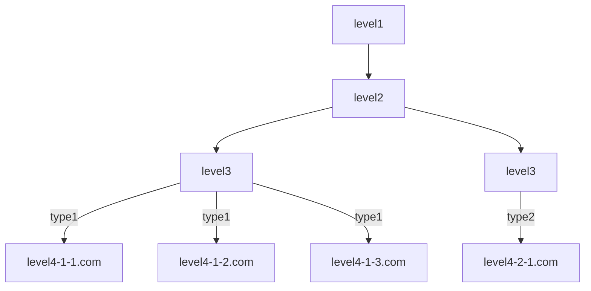

# mermaid

```mermaid
graph TD
    A[level1] --> B[level2]
    B --> C[level3]
    B --> D[level3]
    C -->|type1| E[level4-1-1.com]
    C -->|type1|F[level4-1-2.com]
    C -->|type1|G[level4-1-3.com]
    D -->|type2|H[level4-2-1.com]
```

https://about.gitlab.com/handbook/tools-and-tips/mermaid/
